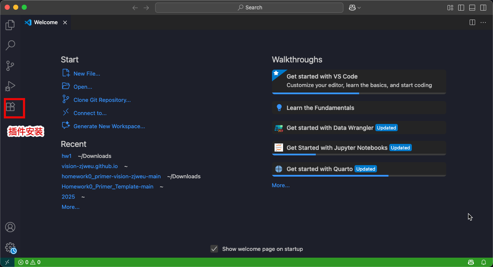
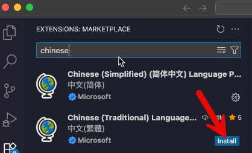
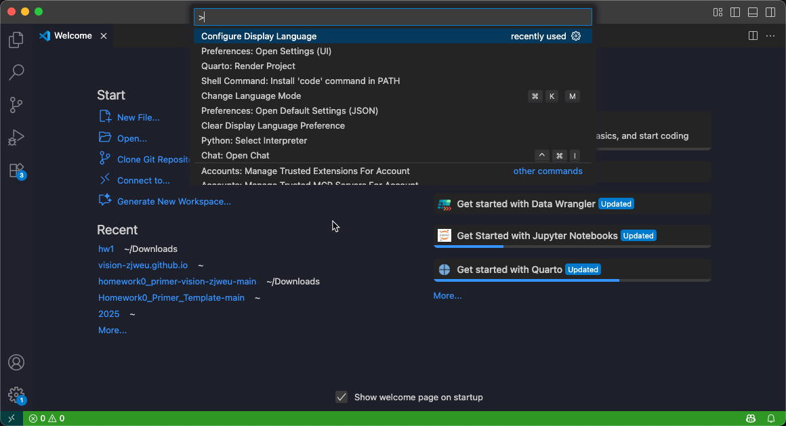
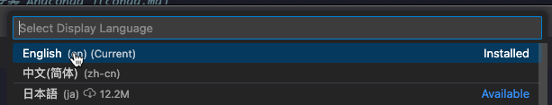
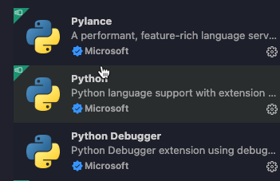
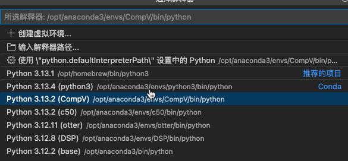
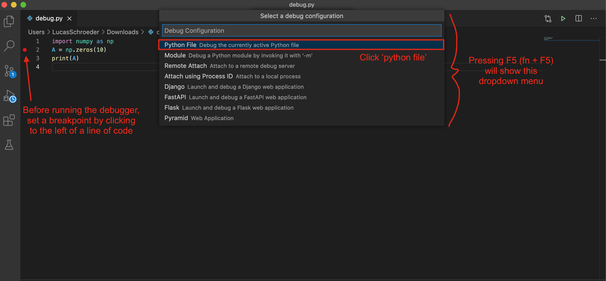
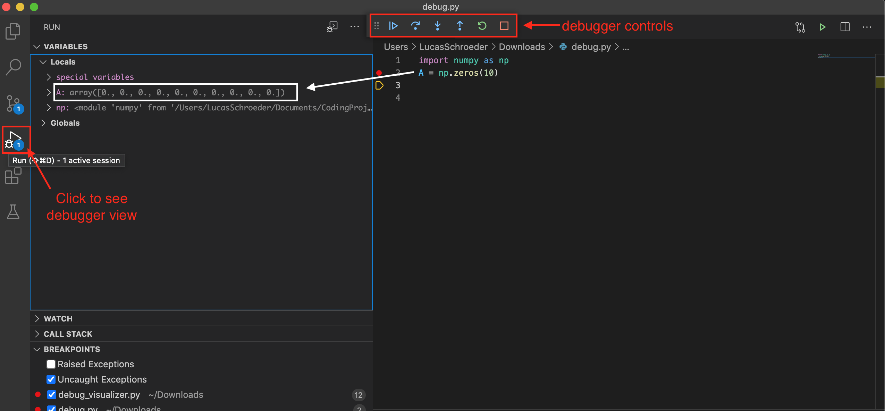

<link href="style.css" rel="stylesheet">
<div style="display:none">
	<!-- Define LaTeX commands here -->
	\(
		\DeclareMathOperator*{\argmin}{arg\,min}

		\newcommand{\DB}{\mathbf{D}}
		\newcommand{\NB}{\mathbf{N}}
		\newcommand{\PB}{\mathbf{P}}
		\newcommand{\SB}{\mathbf{S}}
		\newcommand{\XB}{\mathbf{X}}

		\newcommand{\xB}{\mathbf{x}}
		\newcommand{\yB}{\mathbf{y}}
	\)

</div>

<i class="fa fa-code icon-large"></i>
<i class="fa fa-robot icon-large"></i>
<i class="fa fa-file icon-large"></i>

# Anaconda

当你对 Python 的工具有疑问时，可以参考 [Python 标准库文档](https://docs.python.org/3.7/library/index.html){:target="_blank"}
。

我们建议你安装最新的 [Anaconda](https://www.anaconda.com/download/){:target="_blank"} （Python 3.12 版本）。Anaconda 是一个 Python 包管理器，其中已经包含了本课程所需的大部分Python库。

[Anaconda百度网盘链接](https://pan.baidu.com/s/1JYNiSFtiaCKW3S0v3-xxiw?pwd=uc43)

在本课程中，我们将大量使用以下Python库：

 - [Numpy](https://numpy.org/doc/stable/user/quickstart.html){:target="_blank"} 
 - [Matplotlib](https://matplotlib.org/stable/tutorials/introductory/pyplot.html){:target="_blank"} 
 - [OpenCV](https://opencv.org/){:target="_blank"}
 - PyTorch

# VSCode 环境

## 简介

VSCode 是一个基于图形界面的文本编辑器和开发环境。系里的电脑上已经预装了 VSCode，本地电脑则可以从 VSCode 官网下载安装。安装完成后，我们会将 VSCode 配置为使用我们的虚拟环境。VSCode 是本课程唯一正式支持的 IDE。

[VSCode百度网盘链接](https://pan.baidu.com/s/1JYNiSFtiaCKW3S0v3-xxiw?pwd=uc43)

*本指南假设你已经在电脑上安装了 conda 并设置好了虚拟环境。*

## 更换中文显示

完成安装后点击左侧插件扩展按钮



在列表中搜索`chinese`关键字



点击install，安装对应的简体中文扩展。扩展安装完成后，点击`Shift+Ctrl+P`呼出VSCode设置菜单



点击`Configure Display Language`，选择中文（简体），VSCode会要求重启程序完成设置。




## 安装Python和Jupyter Notebbok插件

当你第一次在 VSCode 中打开一个 `Python` 文件时，它会提示你安装 `Python` 扩展，请务必进行安装！

我们建议你确保已安装来自 Microsoft 的 `Python` 、`Python Debugger` 和 `Pylance` 扩展。



对于Jupyter Notebook，安装 Microsoft 的 `Jupyter` 扩展。 


## 在 VSCode 中选择 Python 解释器

当你打开一个 Python 文件时，请查看 VSCode 界面右下角。你会看到 VSCode 已经选择了一个 Python 解释器。
如果你安装的是anaconda，这里应该显示base（Python 3.X.X），那么就一切就绪，可以开始使用了。


如果它没有显示为 3.X.XX (base)，请点击该文字（实际上它是一个按钮）。
这时会弹出如下菜单：



如果你对使用conda配置python虚拟环境比较有经验，可以自行配置并选择对应解释器。

## 终端 vs 运行按钮

在 VSCode 中打开终端（CTRL+~）时，并不会自动进入 conda 环境，因此请务必手动激活它！

另外需要注意，使用 VSCode 的 运行按钮 执行代码，与在终端中运行代码的行为可能会有所不同。
作业 HW1 会提供一份指南，帮助你正确配置运行按钮，使其能够自动启动正确的 conda 环境。

# Debugging 代码调试

安装好 `Python` 扩展后，我们就可以进行代码调试了。相比于使用 `print` 语句，这种方式更加强大和灵活，因为我们能够交互式地检查程序的状态。

在 调试控制台`（Debug Console）` 中，我们甚至可以执行任意代码，比如交互式地查询变量或编写条件语句。

## 调试步骤

1. 通过点击代码行左侧或在该行按下 `F9` 来设置断点。
2. 按下 `F5` 启动调试器。如果出现下拉菜单，请选择 `Python File`，以便正确配置调试器来调试该 `Python` 文件：

3. 点击左侧工具栏中的调试器图标，可以展开调试器视图。
4. 使用其中的工具可以逐步执行代码，你可以：
- 运行代码直到遇到断点
- 单步进入（step into） 函数（查看函数内部的代码）
- 单步跳过（step over） 函数（跳到当前函数的下一行）
- 单步跳出（step out） 函数（返回到当前函数调用后的下一行）
- 重新启动程序（restart）
- 停止程序（stop）



如需更多详细信息，请查看 [VS Code](https://code.visualstudio.com/docs/debugtest/debugging) 的相关页面。
该页面提供了关于如何进入调试器，以及如何设置和导航断点的说明。

# Jupyter Notebook 转换成 PDF 文件

在终端输入`jupyter nbconvert --to webpdf + 你的文件名.ipynb`或者在Jupyter notebook 代码行输入 `!`后接上述命令

```bash
jupyter nbconvert --to webpdf filtering.ipynb
[NbConvertApp] Converting notebook filtering.ipynb to webpdf
[NbConvertApp] Building PDF
[NbConvertApp] PDF successfully created
[NbConvertApp] Writing 385168 bytes to filtering.pdf
```

注意，webpdf生成需要`playwright`库，并安装`chronium`

```bash
pip install playwright
```

安装`playwright`库
```bash
pip install playwright
```

安装`chromium`
```bash
playwright install chromium
```bash
