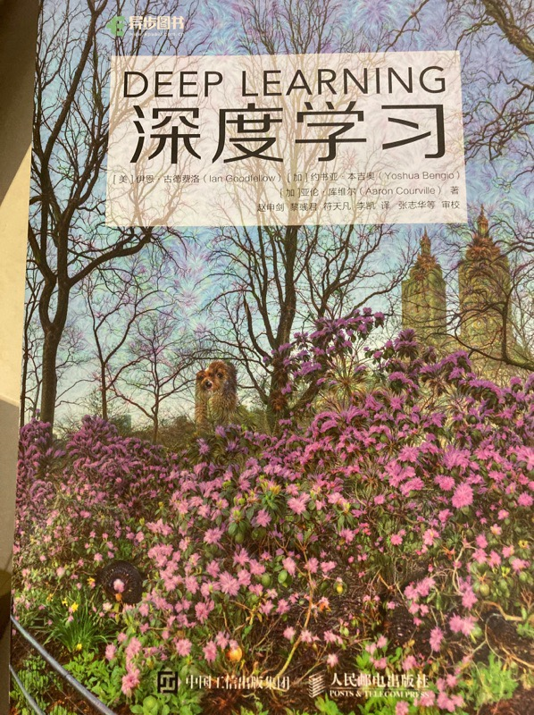

<link href="style.css" rel="stylesheet">

# 编程项目

<!-- ## 环境搭建

- [安装`Anaconda`](conda.md)
- [设置`VS Code`](vscode.md) -->

## 实践课
- [0: 环境搭建](conda.md) 上课前请在自己电脑安装好Anaconda、VS Code和腾讯会议
- 1: Numpy
<!-- - [练习 2: 数据可视化](hw2.md) -->

<!-- ## 理论课
- [Homework 1: Numbers and Images](hw1en.md) -->
<!-- 
## 实践期末项目指导

详细说明见 [这里](proj.md)。 -->

# 课程说明

## 先修要求

我们将假设你已经熟悉以下主题，并且不会在课堂上再进行复习：
- **程序设计** - 你应该已经修过C语言的课程。
- **Python** - 所有的项目都设计Python编程。

如果你在这些主题上有一定背景会很有帮助。我们会提供相关内容的复习提示，但不会进行全面而系统的讲解：
- **Array Manipulation 数组操作** - 作业将大量涉及使用 [NumPy](https://numpy.org/){:target="_blank"} 和 [PyTorch](https://pytorch.org/){:target="_blank"}操作多维数组。事先有一定接触会很有帮助，但如果你从未使用过它们，那么第一次课堂实践会帮助你快速上手。
- **Linear Algebra 线性代数** - 除了基本的矩阵和向量运算之外，你还需要了解叉乘（cross product）、特征向量（eigenvectors）以及奇异值分解（singular value decomposition）。
- **Calculus 微积分** - 你应该熟练掌握链式法则，并且能够对向量值函数进行偏导数计算。

计算机视觉在很大程度上就是将线性代数应用于现实世界的数据。如果你对线性代数或微积分不熟悉，以往的经验表明，你可能会在这门课程中遇到困难。若你只是有些生疏，我们会针对必要的主题提供数学复习，但这些内容并不适合作为入门。

## 教材

本课程没有指定的教材。以下几本可选书籍可能会对你有用，我们也会在部分课程中推荐这些书籍的阅读内容：
- Computer Vision: Algorithms and Applications by Richard Szeliski: [这里可以获取免费版本](http://szeliski.org/Book/){:target="_blank"}. (S)

- （花书）Deep Learning, by Goodfellow, Bengio, and Courville. [这里可以线上浏览英文版](https://www.deeplearningbook.org/)

{width=100 height= 120}

## 如何评分

机器视觉课程:
- **平时分 (35%)**: 包括出勤，课堂表现，课堂回答问题等。采用扣分制。
- **编程项目 (65%)**: 由本学期所有小型项目作业组成。

机器视觉实习课:
- **平时分 (40%)**: 包括出勤，课堂表现，课上项目。采用扣分制。
- **合作项目 (60%)**: 第5周提交项目计划书，第9周和第13周提交进度报告，第17周完成项目答辩和最终报告。

## 课程规定

### 作业提交
请在学习通完成作业提交.
- **Jupyter Notebook** - 需要提交有运行结果的ipynb文件，没有运行结果作业计0分。
- **Python** - 根据清单检查zip文件是否包含所有必须程序文件，在学习通提交zip文件。

### 作业抄袭/合作
- **自动化抄袭检测**: 绝大多数学生都是诚实守信的。为了确保诚实的行为成为受到激励的行为，我们将对提交的作业运行自动查重。
- **提供作业给他人抄袭**：按照作弊一致处理。
- **和同学合作**: 你绝不应该知道他人作业的具体实现细节，也不应该查看他们的代码。以团队形式合作，以及就输出结果或策略给出一些笼统的建议（例如：‘如果你把图像合并后发现画面非常暗，很可能是你在图像掩码和图像数量上出了问题’）是非常好的。然而，结对编程或与直接调试他人的代码是不被允许的。

   
   **Important:** 作业作弊行为发现1次期末总分乘0.9，第二次发现本门课程不及格且无补考机会。

### AI使用
- **使用AI**: 我们强烈不鼓励使用诸如 Deepseek 之类的工具。我们知道无法完全阻止你们使用，但依赖它们会使你们在本课程中几乎得不到实际的编程能力训练。本课程所使用的库是业界标准，能够熟练掌握它们将对你们非常有帮助。
- **使用AI对成绩影响**：作业使用AI将乘以 `0.6-0.9` 的惩罚系数。